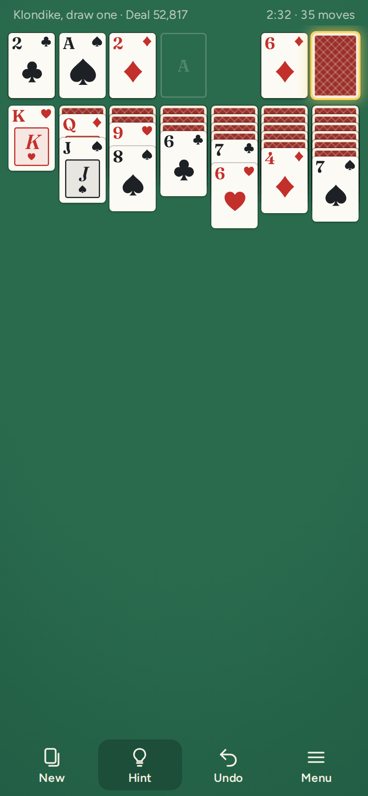
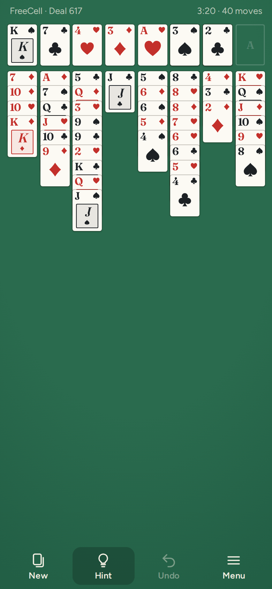
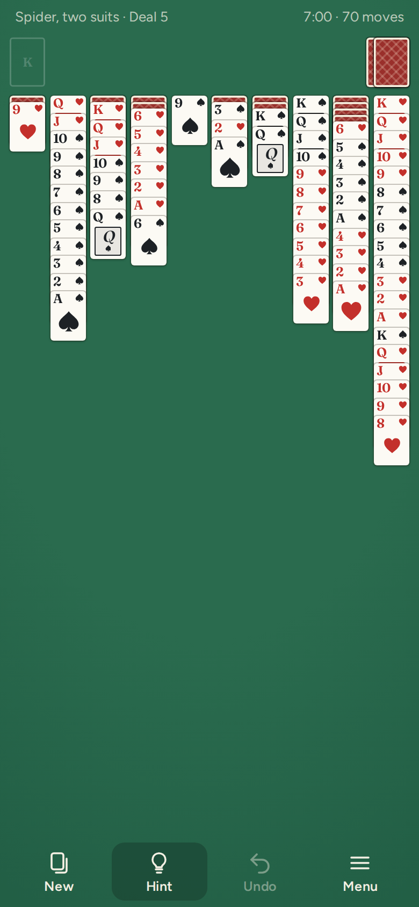
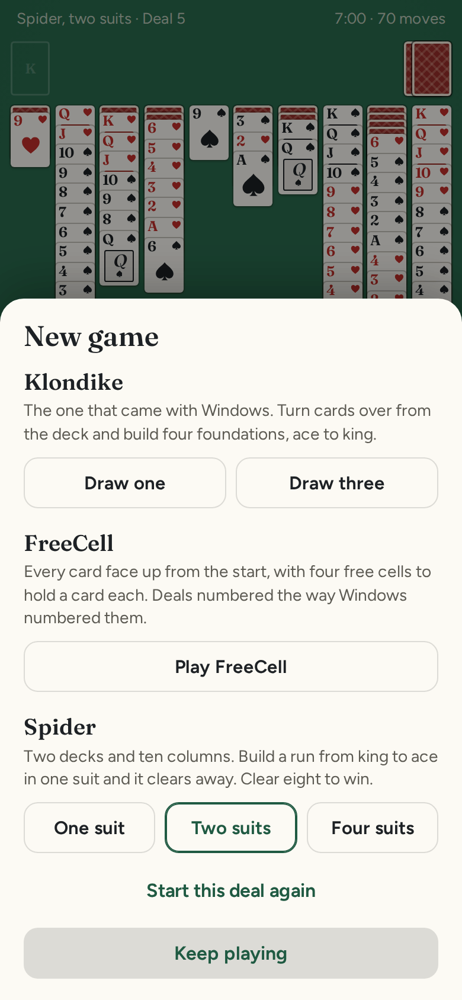
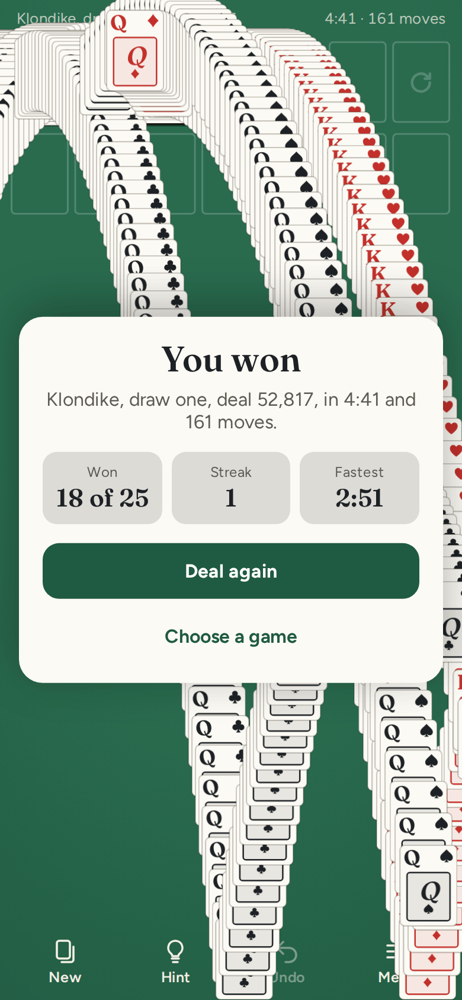

# Patience

**Play it: [patience.junkdrawer.works](https://patience.junkdrawer.works/)**

**Klondike, FreeCell and Spider solitaire with no ads, no account and nothing to wait for.** Tap a card to send it where it fits or drag it there yourself, and undo as far back as you like. Every deal has been played through before it reaches you, so there's always a way to win, and the Hint button knows it.

<p align="center">
  
  &nbsp;
  
  &nbsp;
  
</p>
<p align="center">
  
  &nbsp;
  
</p>

## How it plays

- **Klondike, the one that came with Windows.** Build the four foundations from ace to king, one suit each. In the seven columns, cards go down in alternating colours, and only a king can go in an empty column. Draw one card at a time or three, and go through the stock as many times as you like.
- **FreeCell.** All 52 cards face up from the start, four free cells to hold a card each, and any card can go in an empty column. A run moves as one when there'd be room to move it a card at a time. The deals are numbered the way the FreeCell that came with Windows numbered them, so game 617 here is game 617 there.
- **Spider, with one, two or four suits.** Two decks in ten columns. Build down in any suit, but only a run of one suit moves together, and a run from king to ace of one suit clears away. Tap the deck to deal a row, once every column has a card. Clear all eight runs to win.
- **Tap or drag.** A tap sends cards to the best place: up to a foundation if they can go, otherwise onto a column (in FreeCell, a free cell if nothing else fits; in Spider, a card of the same suit first). Drag a card, or a run, anywhere the rules allow; drop it somewhere it doesn't fit and it slides back.
- **Undo all the way back,** even after closing the page and coming back to it.
- **Deals that can be won.** Before a deal reaches you, a solver plays it through, seeing every face-down card, and any deal it can't win in time is shuffled away. Four-suit Spider is slow to check, so the first one comes from a list of deals already checked while the next is found in the background. Turn this off in the menu if you'd rather take your chances.
- **A hint that knows the way.** Hint asks the same solver for the next move from where you are. If an earlier move has left no way to win, it says so, and Undo takes you back to try another.
- **Cards go up by themselves** in Klondike and FreeCell once nothing on the table could still need them, and when the rest is in order the game finishes itself. You can switch the first part off.
- **The bouncing cards** when you win, as tradition requires.
- **Your record** for each of the six ways of playing: games played, won, win rate, streak, best streak and fastest win.
- **Settings:** four-colour suits (clubs green, diamonds blue), the deck on the left instead of under your right thumb, and hiding the time and moves.
- **On a keyboard,** Space uses the deck, Z undoes, H gives a hint and N starts a new game.
- No ads, no account and no server. Your game, your record and your settings stay in your browser. It works offline and installs to a phone's home screen.

## Running it

It's a static site: plain HTML, CSS and JavaScript, with no build step.

```sh
npx serve .                       # or any static file server, then open the printed address
npm install                       # once, for the bundler and the screenshot tool's PNG compressor
npm test                          # the rules and the solvers in Node, then every game played in Chromium (needs Playwright)
node tools/screenshots.mjs        # redraws docs/*.png and og.png
node tools/make-icons.mjs         # redraws the PNG icons from icon.svg
npm run build                     # bundles everything into dist/patience.html, one file you can send around
node dev/solver-check.mjs 200 3   # solves 200 Klondike deals drawing three, and replays every win through the rules
node dev/freecell-check.mjs 100   # the same for FreeCell, checking every move by its own rules
node dev/spider-check.mjs s2 30   # the same for Spider with two suits (s1, s2 or s4)
node dev/spider-deals.mjs 120     # rewrites the list of four-suit Spider deals checked in advance
```

To put it online with GitHub Pages: **Settings → Pages → Build and deployment → Deploy from a branch**, then pick `main` and `/ (root)`.

### Files

- `js/games/`: the rules of each game, all with the same parts so the rest of the app doesn't need to know which is being played (`index.js` lists them and what each part does). `spider-deals.js` is the list of four-suit Spider deals checked in advance.
- `js/solvers/klondike.js`: the Klondike solver. A depth-first search that sees the face-down cards, offers every card the stock can reach as a move of its own, and never looks at the same position twice. Within its limit it wins about 84% of deals drawing one and 73% drawing three, close to the share that can be won at all.
- `js/solvers/best-first.js`: a best-first search shared by the FreeCell and Spider solvers, which always looks next at the most promising position found so far.
- `js/solvers/freecell.js`: the FreeCell solver. It wins 99 of the first 100 Windows deals in about a tenth of a second each, and proves game 11982, the famous one, can't be won.
- `js/solvers/spider.js`: the Spider solver. It wins nearly every one-suit deal and nine in ten two-suit deals within its limit; four-suit deals are harder, a little over one in four.
- `js/deals.js`: runs a solver a slice at a time, between frames, to find winnable deals and hints.
- `js/table.js`: the table. Card sizes and layout for whichever game it is, the movement, tapping and dragging.
- `js/win.js`: the bouncing cards.
- `js/app.js`: the game itself: undo, the clock, the record, settings and saving.
- `js/cards.js`, `js/suits.js`, `js/rng.js`: the cards, the four suit shapes, the seeded shuffle that turns a deal number into a deal, and Windows' FreeCell shuffle.
- `fonts/`: Fraunces and Figtree (SIL Open Font License), served from here so nothing loads from elsewhere.
- `sw.js`: keeps a copy for playing offline.
- `test/`: the rules and the solvers in Node, and every game played through the real page.
- `dev/`: tools used while building it: the solver checks, quick screenshots, and a helper that plays a deal part way.
