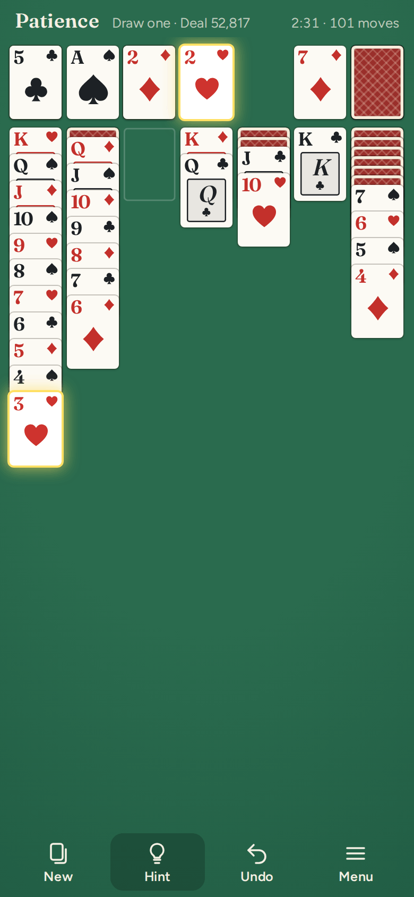
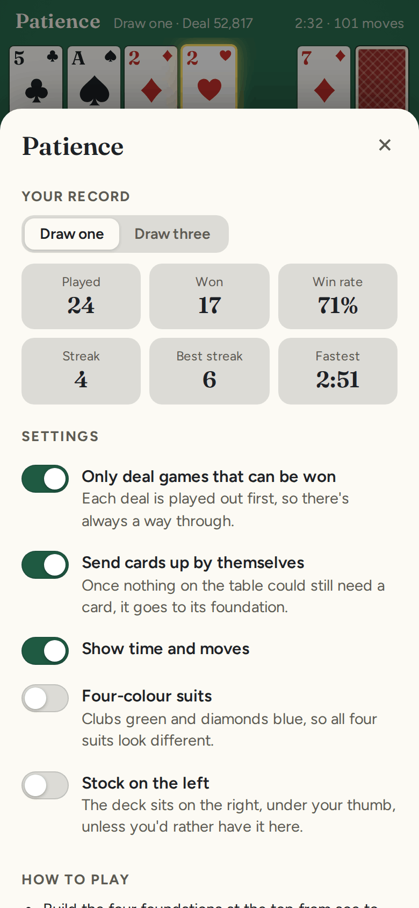

# Patience

**Play it: [junkdrawer.works/patience](https://junkdrawer.works/patience/)**

**Klondike solitaire with no ads, no account and nothing to wait for.** Draw one or draw three, tap a card to send it where it fits or drag it there yourself, and undo as far back as you like. Every deal has been played through before it reaches you, so there's always a way to win, and the Hint button knows it.

<p align="center">
  
  &nbsp;
  
  &nbsp;
  
</p>

## How it plays

- **Klondike, the one that came with Windows.** Build the four foundations from ace to king, one suit each. In the seven columns, cards go down in alternating colours, and only a king can go in an empty column. You can go through the stock as many times as you like.
- **Draw one or draw three.** Pick with New game. Drawing three, only the top card of the three is yours to play.
- **Tap or drag.** A tap sends a card up to its foundation if it can go, otherwise onto a column it fits. Drag a card, or a run of them, anywhere the rules allow; drop it somewhere it doesn't fit and it slides back.
- **Undo all the way back,** even after closing the page and coming back to it.
- **Deals that can be won.** Before a deal reaches you, a solver plays it through, seeing every face-down card, and any deal it can't win in time is shuffled away. Turn this off in the menu if you'd rather take your chances.
- **A hint that knows the way.** Hint asks the same solver for the next move on a winning line from where you are. If an earlier move has left no way to win, it says so, and Undo takes you back to try another.
- **Cards go up by themselves** once nothing on the table could still need them, and when every card is face up the rest of the game plays itself. You can switch the first part off.
- **The bouncing cards** when you win, as tradition requires.
- **Your record** for each way of playing: games played, won, win rate, streak, best streak and fastest win.
- **Settings:** four-colour suits (clubs green, diamonds blue), the stock on the left instead of under your right thumb, and hiding the time and moves.
- **On a keyboard,** Space draws, Z undoes, H gives a hint and N starts a new game.
- No ads, no account and no server. Your game, your record and your settings stay in your browser. It works offline and installs to a phone's home screen.

## Running it

It's a static site: plain HTML, CSS and JavaScript, with no build step.

```sh
npx serve .                       # or any static file server, then open the printed address
npm install                       # once, for the bundler and the screenshot tool's PNG compressor
npm test                          # the rules and the solver in Node, then a game played in Chromium (needs Playwright)
node tools/screenshots.mjs        # redraws docs/*.png and og.png
node tools/make-icons.mjs         # redraws the PNG icons from icon.svg
npm run build                     # bundles everything into dist/patience.html, one file you can send around
node dev/solver-check.mjs 200 3   # solves 200 deals drawing three, and replays every win through the rules
```

To put it online with GitHub Pages: **Settings → Pages → Build and deployment → Deploy from a branch**, then pick `main` and `/ (root)`.

### Files

- `js/klondike.js`: the rules. Dealing, moving, drawing, where a tap sends a card, and which cards can go up by themselves.
- `js/solver.js`: the solver. A depth-first search that sees the face-down cards, offers every card the stock can reach as a move of its own, and never looks at the same position twice. Within its limit it wins about 84% of deals drawing one and 73% drawing three, close to the share that can be won at all.
- `js/deals.js`: runs the solver a slice at a time, between frames, to find winnable deals and hints, and notices when you're out of moves.
- `js/table.js`: the table. Card sizes and layout, the movement, tapping and dragging.
- `js/win.js`: the bouncing cards.
- `js/app.js`: the game itself: undo, the clock, the record, settings and saving.
- `js/cards.js`, `js/suits.js`, `js/rng.js`: the cards, the four suit shapes and the seeded shuffle that turns a deal number into a deal.
- `fonts/`: Fraunces and Figtree (SIL Open Font License), served from here so nothing loads from elsewhere.
- `sw.js`: keeps a copy for playing offline.
- `test/`: the rules and the solver in Node, and a game played through the real page.
- `dev/`: tools used while building it: the solver check, quick screenshots, and a helper that plays a deal part way.
